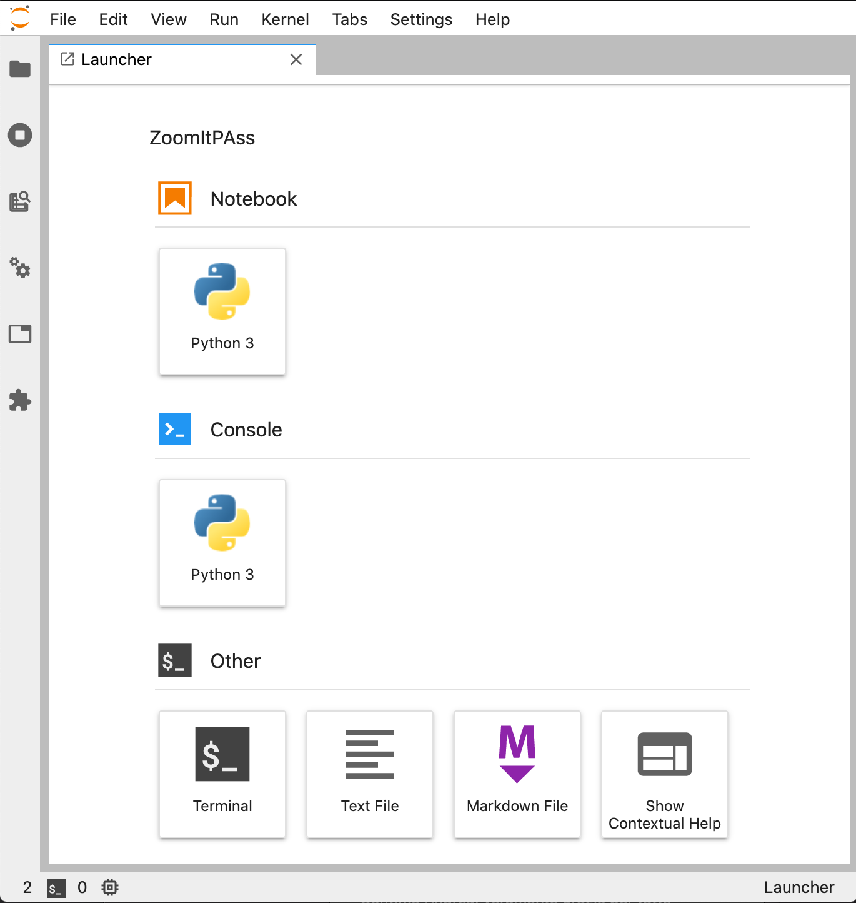

# FORMAZIONE: JupyterLab Intro
*Appunti per il gruppo di studio IPASS sul Machine Learning*

Traccia per la sessione introduttiva a **JupyterLab**

### Premessa

Innanzi tutto esitono già tutorial sull'uso di JupyterLab (ad esempio [Jupyter Lab Tutorial](https://www.youtube.com/watch?v=7wfPqAyYADY)) quindi lo scopo di questo documento è esclusivamente accompagnare il Webinar che verrà programmato da **FAQ400** a breve.

Alcuni cenni *storici* saranno utili e possono trovare un approfondimento in questo saggio introduttivo: [Introduction to Jupyter Notebooks](https://programminghistorian.org/en/lessons/jupyter-notebooks). 

### Interfaccia grafica

**JupyterLab** costituisce la ultima generazione nella evoluzione del **Progetto Jupyter**. Offre i componenti base dello *Jupyter Notebook* classico (notebook, terminale, editor di testi, browser dei documenti, eccetera) in una interfaccia nuova, potente e flessibile.

I tradizionali progetti Jupyter Notebook sono ospitati come oggetti speciali al pari di altri oggetti speciali: la gamma dei quali è in continua espansione grazie alla architettura aperta al contributo di terze parti.

Di fatto si tratta di un IDE per web. 

Ne studiamo prima gli aspetti standard e poi le possibilità di integrazione offerte verso il mondo IBM i.

## Utilizzo standard

SESSIONE INTERATTIVA

[Jupyter Lab on-air](http://gesis400:14143/lab?)

## Utilizzo specifico per IBM i 

Potrà sembrare banale ma la prima cosa che appare ovvia a chiunque si sia confrontato con il mondo Open Source in ambito IBM i è che il **Terminal** offerto da JupyterLab è *eccezionale*. Risolve molte complessità all'utente finale supportando Unicode, le *Unix* pipe, il tunneling via WebSocket. 

La impossibilità di supportare (ad oggi) **Jupyter Hub** frena gli entusiasmi per una adozione più estesa, ma per chi sviluppa è sicuramente una manna.

Partiamo quindi da qui.

Il panel standard con cui si avvia Jupyter Lab è il **Launcher**. In Inglese, *to launch* significa *avviare* quindi da questo pannello si avviano i diversi programmi che compongono l'IDE di Jupyter Lab.

Icone giganti rappresentano i diversi programmi: queste sono organizzate in tre sezioni/raggruppamenti:

* Notebook
* Console
* Other

È nella terza sezione che troviamo **Terminal**.

Ad ogni pressione del bottone viene avviata una nuova sessione di terminale che utilizzerà un panel dedicato. Avremo così Terminal 1, Terminal 2, e così via. Uno solo dei panel riceverà l'input della tastiera e sarà quello la cui etichetta non è grigia.  

